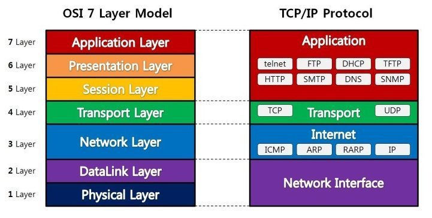

# OSI 7계층



## 1) 물리(Physical)

- 데이터를 전기 신호로 바꾸어주는 계층
- 데이터를 전송하는 역할
- 단위: bit
- 리피터, 케이블, 허브

## 2) 데이터 링크(Data Link)

- 프레임에 Mac 주소를 부여하고 데이터의 물리적인 전송과 에러 검출, 흐름 제어를 담당
- 송수신되는 데이터를 관리하여 안전하게 전달되도록 함
- 단위: frame
- 브릿지, 스위치

## 3) 네트워크(Network)

- 패킷을 목적지까지 가장 빠른 길로 전송
- 라우터를 통해 이동할 경로를 선택하여 IP 주소를 지정하고, 해당 경로에 따라 패킷을 전달
- 단위: packet
- 라우터, IP

## 4) 전송(Transport)

- 최종 수신 프로세스로 데이터의 전송을 담당
- TCP와 UDP 프로토콜을 통해 통신을 활성화
- 단위: segment

```
  TCP: 신뢰성, 연결지향적
  UDP: 비신뢰성, 비연결성, 실시간
```

## 5) 세션(Session)

- 컴퓨터끼리 통신을 하기 위한 논리적 연결을 담당
- TCP/IP 세션을 만들고 없애는 계층
- API, Socket

## 6) 표현(Presentation)

- 데이터의 형식을 정의
- 데이터 표현에 대한 독립성을 제공하고 암호화
- 파일 인코딩, 명령어를 포장, 압축, 암호화
- JPEG, MPEG

## 7) 응용(Application)

- 사용자에게 통신을 위한 서비스 제공
- 사용자 인터페이스, 전자우편, 데이터베이스 관리 등의 서비스 제공
- HTTP, FTP, DNS