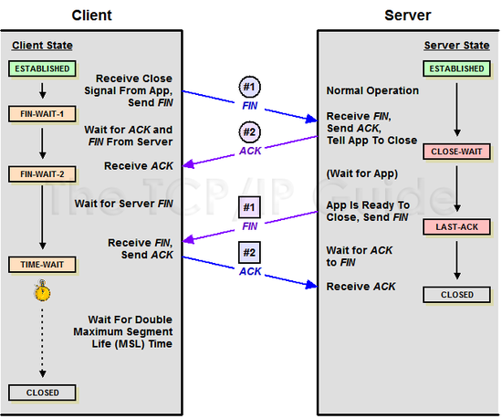

# TCP/UDP의 차이점

## TCP

- 연결형 서비스
- 3-way handshaking 과정을 통해 연결을 설정하기 때문에 높은 신뢰성을 보장
- 4-way handshaking 과정을 통해 연결을 해제
- 속도가 비교적 느림
- 신뢰성이 중요한 파일 교환의 경우에 사용

`3-way handshake`

- TCP 네트워크에서 통신하는 장치가 서로 연결이 잘 되었는지 확인하는 방법
- 송신자와 수신자는 총 3번에 걸쳐 데이터를 주고 받으며 통신이 가능한 상태인지 확인

`4-way handshake`

- TCP 네트워크에서 통신하는 장치의 연결을 해제하는 방법
- 송신자와 수신자는 총 4번에 걸쳐 데이터를 주고 받으며 연결을 끊음

## UDP(User Datagram Protocol)

- 데이터를 데이터그램 단위로 처리하는 프로토콜
- 전송 계층에서 사용하는 프로토콜
- 비연결형 서비스
- 3-way handshaking을 사용하지 않기 때문에 신뢰성이 떨어짐
- 데이터 수신 여부를 확인하지 않기 때문에 속도가 빠름
- 실시간성이 중요한 스트리밍, 온라인 게임에 자주 사용됨

| 프로토콜 종류 | TCP | UDP |
| --- | --- | --- |
| 연결 방식 | 연결형 서비스 | 비연결형 서비스 |
| 패킷 교환 방식 | 가상 회선 방식 | 데이터그램 방식 |
| 전송 순서 | 전송 순서 보장 | 전송 순서가 바뀔 수 있음 |
| 수신 여부 확인 | O | X |
| 통신 방식 | 1:1 | 1:1, 1:N, N:N |
| 신뢰성 | 높음 | 낮음 |
| 속도 | 느림 | 빠름 |