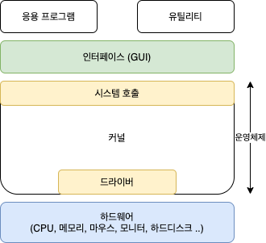

# 운영체제(Operating System)

## 운영 체제(Operating System)란?

- 하드웨어를 관리
- 컴퓨터 시스템의 자원들을 효율적으로 관리
- 응용 프로그램과 하드웨어 간의 인터페이스로써 다른 응용 프로그램이 유용한 작업을 할 수 있도록 환경을 제공
- **사용자가 컴퓨터를 편리하고 효과적으로 사용할 수 있는 환경을 제공하는 시스템**
- ex) Windows, Linux, UNIX, MS-DOS

## 운영 체제의 역할

### 프로세스 관리

- 운영 체제에서 작동하는 응용 프로그램을 관리
- 현재 CPU를 점유해야 할 프로세스를 결정하고, CPU를 프로세스에 할당하며, 이 프로세스 간 공유 자원 접근과 통신 등을 관리
- 프로세서, 스레드
- 스케줄링
- 동기화
- IPC 통신

### 저장장치 관리

- 1차 저장 장치에 해당하는 메인 메모리와 2차 저장 장치에 해당하는 하드디스크, NAND 등을 관리
    - 1차 저장 장치
        - 프로세스에 할당하는 메모리 영역의 할당과 해제
        - 각 메모리 영역 간의 침범 방지
        - 메인 메모리의 효율적 활용을 위한 가상 메모리 기능
    - 2차 저장 장치
        - 파일 형식의 데이터 저장
        - 이런 파일 데이터 관리를 위한 파일 시스템을 OS에서 관리
- 메모리 관리
- 가상 메모리
- 파일 시스템

### 네트워킹

- 사용자와 컴퓨터 하드웨어 사이에 위치하여 하드웨어를 운영 및 관리하고 명령어를 제어하여 응용 프로그램 및 하드웨어를 소프트웨어적으로 제어 및 관리
- TCP/IP
- 기타 프로토콜

### 사용자 관리

- 사용자 별로 프라이버시와 보안을 위해 개인 파일에 다른 사용자가 접근할 수 없도록 계정 관리
- 파일이나 시스템 자원에 접근 권한을 지정할 수 있도록 함
- 계정 관리
- 접근 권한 관리

### 디바이스 드라이버

- 하드웨어를 추상화하여 시스템의 자원, 하드웨어를 운영 체제에서 인식하고 관리하여 응용 프로그램이 하드웨어를 사용할 수 있도록 함
- 순차 접근 장치
- 임의 접근 장치
- 네트워크 장치

## 운영 체제의 구조

- 운영 체제는 크게 커널과 유틸리티(응용 프로그램)로 이루어짐
    - 커널
        - 하드웨어와 직접적으로 상호작용하여 하드웨어 자원 관리
    - 유틸리티
        - 커널 위에서 동작하는 프로그램
        - 사용자와 시스템 간의 인터페이스 제공
        - 시스템의 자원 관리와 관련된 작업 수행

### 인터페이스(Interface)

#### CLI(Command Line Interface)

- 텍스트 기반의 인터페이스로, 사용자가 명령어를 입력하여 시스템을 제어
- 개발자가 전문가들이 주로 사용

#### GUI(Graphical User Interface)

- 그래픽 기반의 인터페이스
- 사용자가 마우스 클릭 등의 동작으로 시스템을 제어
- 일반 사용자들이 주로 사용

### 시스템 호출(System Call)

- 운영 체제에서 제공하는 서비스에 접근하기 위한 프로그래밍 인터페이스
- 시스템콜을 호출하면 운영체제의 커널에 있는 함수가 실행되어 다양한 운영체제 서비스(하드웨어 자원에 접근, 프로세스 간 통신, 파일 I/O, 메모리 관리 등)를 이용할 수 있음
- 운영체제가 직접 하드 웨어를 제어하면, 여러 프로그램이 동시에 하드웨어 자원을 사용하려고 할 때 충돌이 발생하므로 시스템콜을 통해 프로그램들이 운영 체제의 서비스를 공유하도록 함

#### modebit

- 사용자 모드와 커널 모드 사이를 전환하기 위한 비트

#### 커널

- 운영 체제를 구성하는 다양한 서비스와 기능(메모리 관리, 프로세스 관리, 입출력 처리, 네트워크 연결 등)을 제공
- 커널의 안정성과 보안성은 운영 체제의 안정성과 보안성을 결정짓는 중요한 요소

#### 드라이버

- 운영 체제와 장치 간의 인터페이스를 담당하는 소프트웨어
- 운영 체제는 하드웨어 자원을 직접 제어하지 않고, 드라이버를 통해 하드웨어 자원에 접근