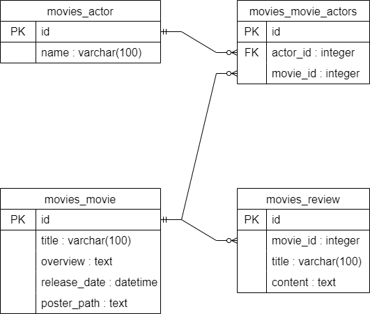

# 07_PJT DB 설계를 활용한 REST API 설계(영화 커뮤니티)

## 프로젝트 목표

- DRF(Django Rest Framework)를 활용한 API Server 제작
- Many to one relationship(N:1)에 대한 이해
- Many to many relationship(N:M)에 대한 이해

## 개발 도구

- Visual Studio Code
- Google Chrome
- Django 4.2.6
- Postman

## 구현 내용

### ERD(Entity-Relationship Diagram)

### Actor

#### Model 작성

- name
    - 배우 이름
    - CharField 사용하여 100자로 제한

#### Serializer 작성

- ActorListSerializer
    - Actor 모델의 id, name 필드만 가져와서 사용
- ActorSerializer
    - Actor 모델의 모든 필드를 가져와서 사용
    - MovieTitleSerializer를 사용하여 movies 필드 설정
        - many=True로 설정하여 중복 표현 값에 대해 리스트로 가져오도록 설정
        - read_only=True로 설정하여 유효성 검사에서는 제외 시키고, 데이터 조회 시에는 출력하도록 설정
- ActorNameSerializer
    - Actor 모델의 name 필드만 가져와서 사용
    - 영화 상세 정보를 조회할 때 출연한 배우의 id가 아닌 name을 가져오도록 하기 위함

#### api 작성

- actor_list
    - 모든 배우 데이터 조회
    - GET 요청이 들어오면 ActorListSerializer 사용하여 가져온 데이터 반환
    
    
    
- actor_detail
    - query parameter로 받은 actor_pk를 사용하여 해당 배우에 대한 데이터 조회
    - GET 요청이 들어오면 ActorSerializer 사용하여 가져온 데이터 반환
    
    
    

### Movie

#### Model 작성

- title
    - 영화 제목
    - CharField 사용하여 100자로 제한
- overview
    - 줄거리
    - TextField 사용
- release_date
    - 개봉일
    - DateTimeField 사용
- poster_path
    - 포스터 주소
    - TextField 사용
- actors
    - 해당 영화에 출연한 배우들
    - ManyToManyField 사용하여 Actor 모델 참조
    - 역참조 매니저 이름 movies로 설정

#### Serializer 작성

- MovieListSerializer
    - Movie 모델의 title, overview 필드만 가져와서 사용
- MovieSerializer
    - Movie 모델의 모든 필드를 가져와서 사용
    - ActorNameSerializer를 사용하여 actors 필드 설정
        - 출연 배우의 id가 아닌 이름을 가져오도록 함
        - many=True로 설정하여 중복 표현 값에 대해 리스트로 가져오도록 설정
        - read_only=True로 설정하여 유효성 검사에서는 제외 시키고, 데이터 조회 시에는 출력하도록 설정
    - ReviewListSerializer를 사용하여 review_set 필드 설정
        - 해당 영화를 참조하는 모든 리뷰 목록을 가져오도록 함
        - many=True로 설정하여 중복 표현 값에 대해 리스트로 가져오도록 설정
        - read_only=True로 설정하여 유효성 검사에서는 제외 시키고, 데이터 조회 시에는 출력하도록 설정
- MovieTitleSerializer
    - Movie 모델의 title 필드만 가져와서 사용
    - 배우 상세 정보를 조회할 때 영화의 id가 아닌 title을 가져오도록 하기 위함

#### api 작성

- movie_list
    - 모든 영화 데이터 조회
    - GET 요청이 들어오면 MovieListSerializer 사용하여 가져온 데이터 반환
    
    
    
- movie_detail
    - query parameter로 받은 movie_pk를 사용하여 해당 영화에 대한 데이터 조회
    - GET 요청이 들어오면 MovieSerializer 사용하여 가져온 데이터 반환
    
    
    

### Review

#### Model 작성

- title
    - 리뷰 제목
    - CharField 사용하여 100자로 제한
- content
    - 리뷰 내용
    - TextField 사용
- movie_id
    - 리뷰 한 영화
    - Foreign Key - Movie 모델 참조
    - Movie 모델의 영화 정보가 지워지면 해당 영화 정보에 달린 댓글도 삭제되도록 설정

#### Serializer 작성

- ReviewListSerializer
    - Review 모델의 title, content 필드만 가져와서 사용
- ReviewSerializer
    - Review 모델의 모든 필드를 가져와서 사용
    - MovieTitleSerializer를 사용하여 movie 필드 설정
        - 해당 리뷰가 참조하는 영화의 title을 가져오도록 함
        - read_only=True로 설정하여 유효성 검사에서는 제외 시키고, 데이터 조회 시에는 출력하도록 설정

#### api 작성

- review_list
    - 모든 리뷰 데이터 조회
    - GET 요청이 들어오면 ReviewListSerializer 사용하여 가져온 데이터 반환
- review_detail
    - query parameter로 받아온 review_pk 사용하여 해당 리뷰에 대한 데이터 조회
    - GET
        - GET 요청이 들어오면 ReviewSerializer 사용하여 가져온 데이터 반환
        
        
        
    - PUT
        - PUT 요청이 들어오면 ReviewSerializer 사용하여 body에 담아 보낸 데이터 기반으로 해당 리뷰 데이터 수정
            - data는 PUT 요청할 때, body에 담겨서 온 request.data로 설정
            - instance는 review로 설정
            - partial=True로 설정하여 데이터 일부분만 수정 가능하도록 설정
            
            
            
    - DELETE
        - DELETE 요청이 들어오면 가져온 데이터 delete 함수로 삭제
        - 정상적으로 삭제되면 ‘review {n} is deleted’ 메시지가 나오도록 설정
        - 정상적으로 삭제되면 status code 204가 나오도록 설정
        
        
        
- create_review
    - POST 요청이 들어오면 ReviewSerializer 사용하여 body에 담아 보낸 데이터를 저장
        - 저장할 때, movie에 대한 정보는 사용자가 입력하지 않으므로 query parameter로 받은 movie_pk를 사용하여 해당 영화에 대한 정보가 저장되도록 설정
        - 저장이 정상적으로 완료되면 저장된 데이터와 함께 201 status code를 반환하도록 설정
        
        